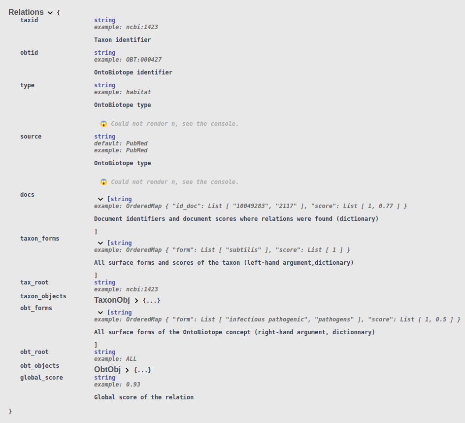
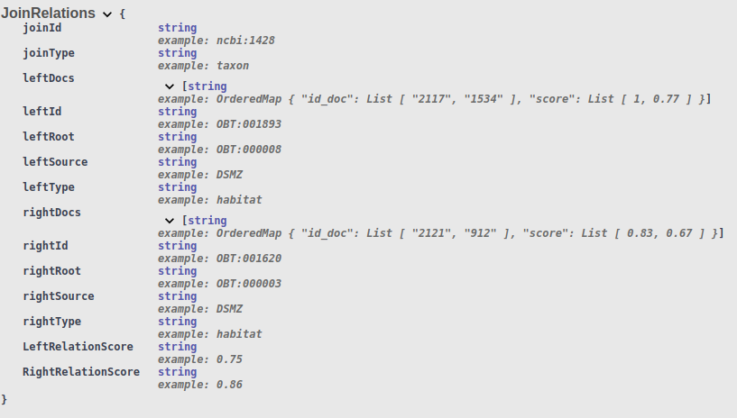
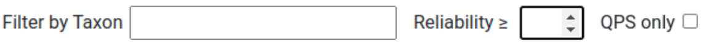
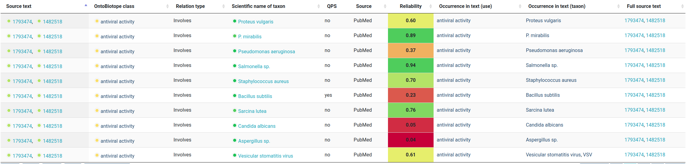
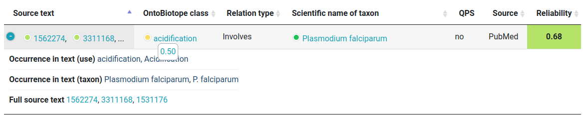
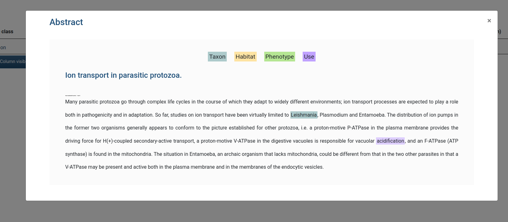
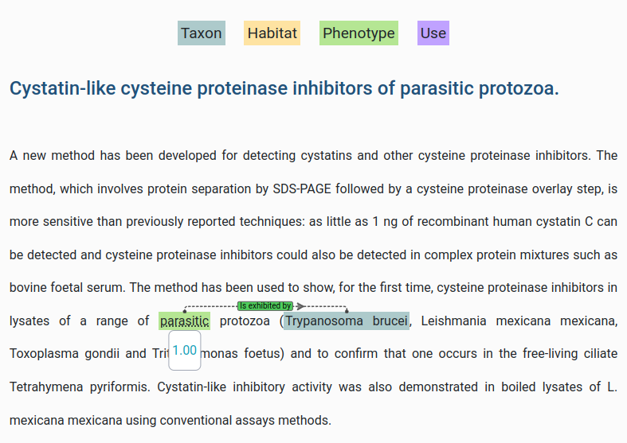

# Intégration d’informations de fiabilité à l’application Omnicrobe

Ce document décrit les modifications que j'ai apportés durant mon stage. Elles ne seront peut-être pas toutes indiquées par manque de temps ou oublie.
Ce document permet à mes encadrantes de voir plus facilement les parties du code modifiés.

# Table des matières <a name="sommaire"></a>


- [Scripts côté serveur](#serveur)
  - [Script `__init__.py` ](#init.py )
    - [API documentation](#api_doc )
    - [URL score](#URL_score_py )
    - [Page de résumé PubMed](#page_abstract)
    - [JSON résumé ](#get_abstract_route )
  - [Script `database.py`](#database.py )
    - [Modifications de requêtes](#requete )
    - [Requête des résumés](#abstractBD )
- [Scripts côté client](#client)
  - [Templates](#template)
    - [Script `searchByUse.html`](#byuse)
    - [Script `sourceAbstract.html`](#abstracthtml)
  - [CSS](#css)
  - [Javascript](#js)
    - [Script ``searchByUse.js``](#byusejs)
    - [Script ``utils.js``](#utils)
      - [Fonction `format_docs`](#format_doc)
      - [Fonction `calculateColor`](#color)
      - [Fonction `isColorDark`](#dark)
      - [Fonction `drawCircle`](#circle)
    - [Script ``sourceAbtract.js``](#abstractjs)
      


##  Mes modifications dans les différents scripts : <a name="modif"></a>

## Scripts côté serveur <a name="serveur"></a>

[Retour Sommaire](#sommaire)

Le côté serveur de l’application est géré en Python via
la librairie Flask.

 - ###  Script ``__init__.py`` <a name="init.py"></a>

[Retour Sommaire](#sommaire)

Un script ``__init__.py`` initie l'application graçe à Flask. Flask est une classe qui permet de créer une instance d’application. Ce script associe des chemins
(URL) à des fonctions (cf. [12]). Un chemin peut mener à une page HTML via une fonction de
Flask, ou mener à une structure JSON via une fonction du script de requête.

##### API documentation <a name="api_doc"></a>

J'ai modifié cette partie pour indiquer le format récupérer via l'API. Le format du dictionnaire JSON renvoyé à changer puisque les scores sont ajoutés.
J'avais fait ces modifications au tout début des mes modifications sur l'interface web. 
Ainsi, il manque des informations : des éléments du dictionnaire ne sont pas indiqué dans cette documentation. 
Il me semble notamment ne pas avoir indiquer les scores d'occurrence et le résumé PubMed. De plus j'avais ajouté le mot 'dictionnaire' dans la description, je pense que c'est à supprimer.

J'ai seulement modifié pour 'Relation' et 'Join'.

```
relation_model = api.model('Relations', {
  "taxid": fields.String(description="Taxon identifier", example="ncbi:1423"),
  "obtid": fields.String(description="OntoBiotope identifier", example="OBT:000427"),
  "type": fields.String(description="OntoBiotope type", enum="['habitat', 'phenotype', 'use']", example="habitat"),
  "source": fields.String(description="OntoBiotope type", enum="['PubMed', 'GenBank', 'DSMZ', 'CIRM-BIA', 'CIRM-Levures']", example="PubMed", default="PubMed"),
  "docs": fields.List(fields.String(description="Document identifiers and document scores where relations were found (dictionary)", example={'id_doc':['10049283','2117'], 'score': [1.0,0.77]})),
  "taxon_forms": fields.List(fields.String(description="All surface forms and scores of the taxon (left-hand argument,dictionary)", example={'form':['subtilis'], 'score': [1.0]})),
  "tax_root": fields.String(example="ncbi:1423"),
  "taxon_objects": fields.Nested(taxonobj_model),
  "obt_forms": fields.List(fields.String(description="All surface forms of the OntoBiotope concept (right-hand argument, dictionnary)", example={'form':["infectious pathogenic", "pathogens"], 'score': [1.0,0.5]})),
  "obt_root": fields.String(example="ALL"),
  "obt_objects": fields.Nested(obtobj_model),
  "global_score": fields.String(description=" Global score of the relation" ,example=0.93)
  })
  join_relation_model = api.model('JoinRelations', {
  "joinId": fields.String(example="ncbi:1428"),
  "joinType": fields.String(example="taxon"),
  "leftDocs": fields.List(fields.String(example={'id_doc':["2117","1534"], 'score':[1.0,0.77]})),
  "leftId": fields.String(example="OBT:001893"),
  "leftRoot": fields.String(example="OBT:000008"),
  "leftSource": fields.String(example="DSMZ"),
  "leftType": fields.String(example="habitat"),
  "rightDocs": fields.List(fields.String(example={'id_doc':["2121","912"], 'score':[0.83,0.67]})),
  "rightId": fields.String(example="OBT:001620"),
  "rightRoot": fields.String(example="OBT:000003"),
  "rightSource": fields.String(example="DSMZ"),
  "rightType": fields.String(example="habitat"),
  "LeftRelationScore": fields.String(example=0.75),
  "RightRelationScore": fields.String(example=0.86)
  })
```

<p align="center"></p>
<p align="center"></p>


##### URL score <a name="URL_score_py"></a>

Pour qu'un URL contenant une information de score mène à la bonne page (avec le filtre de score actif), 
j'ai ajouté un argument score à toutes les 'route' de Flask pour les requêtes simples.

```python
# Search by Use page
@app.route('/searchByUse/')
@app.route('/searchByUse')
def searchByUse():
    use = request.args.get('use', None)
    taxon = request.args.get('taxon', None)
    qps = request.args.get('qps', None)
    score = request.args.get('score', None)
    app.logger.info("score ")
    app.logger.info(score) 
    return render_template('searchByUse.html', use=use, taxon=taxon, qps=qps, 
                                               version=VERSION,
                                               alvisir=URL_ALVISIR, score=score)
```

##### Page de résumé PubMed <a name="page_abstract"></a>

Pour remplacer AlvisIR, j'ai crée une nouvelle page menant à un résumé PubMed. La version finale voulue est une fen^tre pop-up. 
Ces modifications seront à supprimer une fois que la fenêtre pop-up sera complètement fonctionnelle.

```python
# SourceAbstract
@app.route('/sourceAbstract/')
@app.route('/sourceAbstract')
def sourceAbstract():
    id_source = request.args.get('id_source', None)
    id_relation = request.args.get('id_relation', None)
    return render_template('sourceAbstract.html', id_source=id_source,
                                                  id_relation=id_relation,
                                                  )

``` 

L'URL contient deux arguments : l'identifiant du document PubMed et le numéro de relation. En effet, on ne veut un résumé qu'avec les 
annotations liées à la relation d'intérêt.

##### JSON résumé <a name="get_abstract_route"></a>

De la même manière que pour les autres requêtes, un fonction du scripts ``database.py`` requête la base de données et récupère les informations nécessaires sous format JSON.

```python
# Get abstarct
@app.route('/_get_abstract')
def get_abstract():
    id_source = request.args.get('id_source', None)
    id_relation = request.args.get('id_relation', None)
    return(jsonify(list_sourceAbstract(app, conn, id_source,id_relation)))

```

- ###  Script ``database.py`` <a name="database.py"></a>

[Retour Sommaire](#sommaire)

Le script ``database.py`` effectue les requêtes sur la base de données et renvoie les résultats sous forme de listes ou dictionnaires Python.
J'ai modifié toutes les requêtes nécessitant une informations sur la source, puisque les informations de source ont changé de table.
J'ai de plus ajouté une nouvelle requête permettant de récupérer les informations lié au résumé PubMed.

##### Modifications de requêtes <a name="requete"></a>

Les requêtes / fonctions modifiés :
    
- get_doc
- create_sql_relation
- search_join_relations_by_taxon
- search_join_relations_by_taxon_aggregate
- search_join_relations_by_ontobiotope
- search_join_relations_by_ontobiotope_aggregate
- list_relations
- list_advanced_relations
- list_advanced_relations_4
- create_sql_advanced_relation
- create_sql_advanced_relation_3
- get_result_advanced_relation_3
- add_sources

Je présente ci-dessous un exemple classique de mes modifications. En effet, comme la plupart des requêtes se ressemble, 
des modifications similaires sont faites dans les autres fonctions.

```python
def list_relations(app, conn, source, taxonid, qps, ontobiotopeid, types):
    conn = get_db(app)
    oldRelation=  None
    newRelation =None
    oldSource=None
    newSource=None

```
J'initialise des variable old et new, elles me seront utile pas la suite.

```python
    if conn != None:
        cursor = conn.cursor()
        query = "SELECT DISTINCT r.form_taxon, r.score_taxon, r.form_element, r.score_element, d.id_source, \
    r.type, d.source, e.identifier, t.taxonid, t.qps, e.path, t.path, o.doc_score, r.score_global , o.id_relation "
        query += " FROM relation r, taxon t, element e,occurrence o, document d"
        query += " WHERE r.id_element = e.id AND t.id = r.id_taxon"
        query+= " AND o.id_relation=r.id AND o.id_doc=d.id"
        if source != None and source != []:
            query += " AND ("
            for s in source:
                ss = check_source(s)
                query += "d.source = '" + ss + "' OR "
            query += ")"
            query = re.sub(" OR \)", ")", query)
        if qps in ("yes", "true"):
            query += " AND t.qps = 'yes'"
        if types != None and types != []:
            query += " AND ("
            for type in types:
                query += "r.type = '" + type + "' OR "
            query += ")"
            query = re.sub(' OR \)', ')', query)
        if taxonid != None and taxonid != '':
            query += " AND r.id_taxon in (SELECT id FROM taxon t WHERE t.path like '%/" + taxonid + "/%' OR t.taxonid = '" + taxonid + "')"
        if ontobiotopeid != None and ontobiotopeid != '':
            query += " AND r.id_element in (SELECT id FROM element e WHERE e.path like '%/" + ontobiotopeid + "/%' OR e.identifier = '" + ontobiotopeid + "')"

        query += " order by o.id_relation, d.source, d.id_source "
        
```
Dans la requête SQL, j'ajoute une jointure entre la table ``occurrence``et ``relation``, et entre ``occurrence``et ``document``.
J'ajoute à la fin un ``order by``qui me sera utile par la suite.

```python
        try:

            cursor.execute(query)
        except psycopg2.Error as e:
            print(e)
        results = []
        for row in cursor.fetchall():

            # does the relation is already existing ?
```
Après avoir executé la requête, on veut récupérer les résultats. Contrairement à précedemment, tous les documents sources ne sont pas indiqués
dans la table ``relation``. Les jointures avec ``occurrence`` entraine qu'une relation agrégée est associée à plusieurs lignes renvoyées
par la requête, et non plus une seule. On ajoute dans `resultat` les informations de chaque ligne au fur est à mesure. Mais il faut vérifier si la nouvelle 
ligne doit être concatenée avec une déjà existante dans la variable `resultat`. C'est pourquoi les variables old/new et le `order by` sont utilisés.

En effet, les lignes renvoyées par la requêtes sont triés en fonction de l'identifiant de la relation et de la source (source et id_source).
Ainsi les lignes à concatenées sont à la suite. On concatène lorsqu'une ligne à la même relation et même source que la ligne précedente.


```python

            newRelation=row[14]
            newSource=row[6]
            newIdDoc=row[4]

            if newRelation!=oldRelation or newSource != oldSource : #if it doesn't
                newElement=True
                elements = []
                # docs
                elements.append([]) # id source
                elements.append([]) # score doc
                elements.append(clean_form(row[0]).split(", ")) # form txt taxon
                elements.append(row[1].split(", ")) # form txt taxon score
                # relation type
                if row[5] == 'habitat':
                    if taxonid != None:
                        elements.append('Lives in')
                    else:
                        elements.append('Contains')
                if row[5] == 'phenotype':
                    if taxonid != None:
                        elements.append('Exhibits')
                    else:
                        elements.append('Is exhibited by')
                if row[5] == 'use':
                    if taxonid != None:
                        elements.append('Studied for')
                    else:
                        elements.append('Involves')
                elements.append(clean_form(row[2]).split(", ")) # form txt obt
                elements.append(row[3].split(", ")) # form txt obt score

                # qps
                elements.append(row[9])
                # Source
                elements.append(row[6])

                # path and id
                elements.append(row[10])
                elements.append(row[11])
                elements.append(row[7])
                elements.append(row[8])

                # global score
                elements.append(row[13]) # element 13 of list

                # id relation (not to print in datatable)
                elements.append(row[14])
```

On récupère les nouvelles valeurs d'identifiant de relation et la source, on sait ainsi s'il faut concaténer ou non.
Si c'est un nouveau résultat on créer un nouvel élément et on indique toutes les informations communes à plusieurs lignes d'une même
relation.

```python
            else  : # if it does
                newElement=False
                elements=results[len(results)-1]
```

Sinon, on récupère le dernier élément placé dans `resultat`.
Ensuite, on ajoute dans les deux cas (nouvelle relation ou non) les données communes. Ces données sont les documents sources (id)
 et leurs scores associés.

```python
            # add id_source
            if row[4] not in elements[0]:
                elements[0].append(row[4]) # id doc
                elements[1].append(row[12]) # score doc
```

On ajoute l'élément à `resultat` si c'est un nouveau. On met à jour les variables old pour qu'elles prennent les valeurs de la ligne actuelles.

```python

            if newElement : # if new element
                results.append(elements) # we add it

            oldRelation=row[14] #the oldRelation became this one, the next one is the new
            oldSource=row[6]

        cursor.close()
```

Enfin, on repasse dans tous les éléments pour trier les listes de documents et formes de texte par score. Une fois triées, les liste sont
transformées en string séparé par des `,`.
Techniquement on sait qu'on aurait pu trier une relation lorsque l'on passe à la suite dans la partie du code précedente.
Mais c'était plus simple de coder comme j'ai fait. La complexité n'est pas sensé beaucoup augmenter, au lieu de 1 boucle on fait deux boucles indépendante, on ajoute seukement un facteur 2.
Mais une modification comme indiquer pourrait tout de même être à tester afin de réduire le temps de chargement des pages web.

```python
  
        # As the expected format of list of forms, score and source is string : we run through all the elements to concatenate the lists :
        # and we sort them in the string by score
        for elements in results:
            sourceSort=list(zip(*sorted(zip(elements[1],elements[0]), reverse=True)))   
            taxonSort=list(zip(*sorted(zip(elements[3],elements[2]), reverse=True)))
            obtSort=list(zip(*sorted(zip(elements[6],elements[5]), reverse=True)))

            elements[0]=", ".join(map(str,sourceSort[1]))
            elements[1]=", ".join(map(str,sourceSort[0]))
                
            elements[2]=", ".join(map(str,taxonSort[1]))
            elements[3]=", ".join(map(str,taxonSort[0]))
            elements[5]=", ".join(map(str,obtSort[1]))
            elements[6]=", ".join(map(str,obtSort[0]))

        return results
```

##### Requête des résumés <a name="abstractBD"></a>

Il s'agit de la requête appelée pour afficher le résumé sur le site. Elle est appelé dans [JSON résumé](#get_abstract_route).

```python
def list_sourceAbstract(app, conn, idSource, idRelation):
    if (idSource!= None):
        conn = get_db(app)
        if conn != None :
            cursor = conn.cursor()
            if( idRelation != None ):
                query= "SELECT d.text, o.positions, o.score_occ ,r.type, r.form_taxon,r.score_taxon, r.form_element, r.score_element "
                query += " FROM occurrence o, document d,relation r "
                query+= " WHERE o.id_doc=d.id AND o.id_relation=r.id "
                query += "AND d.id_source = '"+ idSource +"' "
                query += " AND o.id_relation = '"+idRelation +"' "
            else : 
                query ="SELECT text FROM document WHERE id_source = '" +idSource +"' "
                
                try:
            cursor.execute(query)
        except psycopg2.Error as e:
            print(e)

        if( idRelation != None ):
            rows=cursor.fetchall()
            results = []
            if (len(rows) != 0 ):
                results.append(rows[0][0]) #text
                results.append([]) # positions
                results.append([]) # score
                results.append(rows[0][3]) #type
                results.append(rows[0][4]) # form taxon
                results.append(rows[0][5]) # score taxon
                results.append(rows[0][6]) # form element
                results.append(rows[0][7]) # score element
                for row in rows:
                    results[1].append(row[1])
                    results[2].append(row[2])
            return results 
        
        else :
            return [cursor.fetchone()[0]]

```


## Script côté client <a name="client"></a>

[Retour Sommaire](#sommaire)

## Templates <a name="template"></a>


- ###  Script ``searchByUse.html`` <a name="byuse"></a>

[Retour Sommaire](#sommaire)

Les modifications présentées sont faites pour les différents html de résultat de requête.

Récupération du score utilisé en filtre dans l'URL.
```html
var score = JSON.parse('{{ score | tojson | safe }}');
```

Récupération de la librairie Recogito. (non fait pour la requête avancée)

```html
 <link rel="stylesheet" href="{{ url_for('static', filename='js/lib/recogito-js-1.8.2/recogito.min.css') }}">
<script src="{{ url_for('static', filename='js/lib/recogito-js-1.8.2/recogito.min.js') }}"></script>
```

Ajout filtre Reliability.

```html
      <table align="center">
        <tr>

          <td id="filter_col4" data-column="3">&nbsp;&nbsp;&nbsp;Filter by Taxon&nbsp;</td>
          <td id="filter_col4_input" data-column="3" align="center">
            <input type="text" class="column_filter" id="taxon_ut">
          </td>

          <td id="filter_col7" data-column="6">&nbsp;&nbsp;&nbsp;Reliability &ge; &nbsp;</td>
          <td id="filter_col7_input" data-column="6" align="center">
            <input type="number" step="0.05" min="0" max="1" class="column_filter_short" id="score_ut">
          </td>

          <td id="filter_col5" data-column="4">&nbsp;&nbsp;&nbsp;QPS only&nbsp;</td>
          <td id="filter_col5_input" data-column="4">
            <input type="checkbox" name="qps_ut" id="qps_ut" value="yes">
          </td>

        </tr>

      </table>
```
<p align="center"></p>


Ajout colonne Reliability.

```html
      <table id="results_use_taxon" class="display responsive nowrap collapsed" style="width:100%"> <!--width="100%" visibility="none"-->
        <thead>
          <tr>
            <th>Source text</th>
            <th>OntoBiotope class</th>
            <th>Relation type</th>
            <th>Scientific name of taxon</th>
            <th>QPS</th>
            <th>Source</th>
            <th>Reliability</th>
            <th>Occurrence in text (use)</th>
            <th>Occurrence in text (taxon)</th>
            <th>Full source text</th>
            <th>ID OntoBiotope</th>
            <th>OntoBiotope hierarchical path</th>
            <th>TaxonID</th>
            <th>Taxonomy hierarchical path</th>
          </tr>
        </thead>
      </table>
```

<p align="center"></p>
<p align="center"></p>

La fenêtre pop-up des résumés. Modifications seulement faite pour ce script puisqu'elle n'est pas entièrement fonctionnelle.
Je n'ai donc pas propager la modification. Le problème est au niveau de la liaison entre les entités : elle n'apparait pas.

```html
  <div id="abstractModal" class="modal fade bd-example-modal-lg" tabindex="-1" role="dialog" aria-labelledby="myLargeModalLabel" aria-hidden="true">
    <div class="modal-dialog modal-dialog-centered custom-modal-size" role="document">
      <div class="modal-content">

                <div style="height: 20px;"></div>

                <div style="margin-left: 5%;margin-right: 5%;">

                      <div>
                      <button type="button" class="close" style="position: absolute; right: 20px;" data-dismiss="modal" aria-label="Close"><span aria-hidden="true">&times;</span></button>
                      <h3><span style="color: #21517A;" id="titlePage">Abstract</span></h3>
                      </div>

                      <div style="height: 30px;"></div>

                      <div class="blockTxt">
                        <div style="height: 20px;"></div>
                        <div style="text-align: center;">
                          <span id="colorLegend" class=" taxon">Taxon</span>
                          <span class="horizontal_space"></span>
                          <span id="colorLegend" class=" habitat">Habitat</span>
                          <span class="horizontal_space"></span>
                          <span id="colorLegend" class=" phenotype">Phenotype</span>
                          <span class="horizontal_space"></span>
                          <span id="colorLegend" class=" use">Use</span>
                        </div> 
                    
                            <div style="height: 20px;"></div>
                            <h4 style="color: #21517A;" id="title_abstract">Title</h4><br/>
                            <p class="text-justify " id="abstract">Content ...</p> 
                  </div>

                  <div style="height: 50px;"></div>
      </div>
    </div>
  </div>
```

<p align="center"></p>

- ###  Script ``sourceAbstract.html`` <a name="abstracthtml"></a>

[Retour Sommaire](#sommaire)

Ce script est utilisé pour l'ouverture dans une nouvelle page des résumés. C'est ce contenu HTML qui a été placé dans la fenêtre pop-up du code ci-dessus.

Il récupère l'identifiant de document et de relation, le javascript associé ira chercher le bon résumé.

```html
  <script type=text/javascript>
    $SCRIPT_ROOT = {{ request.script_root|tojson|safe }};
  </script>

  <script>
    var relation = JSON.parse('{{ id_relation | tojson | safe }}');
    var source = JSON.parse('{{ id_source | tojson | safe }}');
  </script>

  <link href="{{ url_for('static', filename='css/simpleTree.css') }}" rel="stylesheet">
  <link rel="stylesheet" href="{{ url_for('static', filename='css/selectize.css') }}" />
  <link rel="stylesheet" href="{{ url_for('static', filename='css/selectize.boostrap3.css') }}" />
  <link rel="stylesheet" href="{{ url_for('static', filename='css/additional.css') }}" />

<link rel="stylesheet" href="{{ url_for('static', filename='js/lib/recogito-js-1.8.2/recogito.min.css') }}">
<script src="{{ url_for('static', filename='js/lib/recogito-js-1.8.2/recogito.min.js') }}"></script>

  <script src="https://code.jquery.com/jquery-3.6.0.min.js"></script>
  <script type="module" src="{{ url_for('static', filename='js/sourceAbstract.js') }}"></script>


  <div style="height: 200px;"></div>

  <div style="margin-left: 20%;margin-right: 20%;">
    <h3><span style="color: #21517A;" id="titlePage">Abstract</span></h3>

    <div style="height: 50px;"></div>

    <div class="blockTxt">
      <div style="height: 30px;"></div>
      <div style="text-align: center;">
        <span id="colorLegend" class=" taxon">Taxon</span>
        <span class="horizontal_space"></span>
        <span id="colorLegend" class=" habitat">Habitat</span>
        <span class="horizontal_space"></span>
        <span id="colorLegend" class=" phenotype">Phenotype</span>
        <span class="horizontal_space"></span>
        <span id="colorLegend" class=" use">Use</span>
      </div> 
  
          <div style="height: 30px;"></div>
          <h4 style="color: #21517A;" id="title_abstract"></h4><br/>
          <p class="text-justify " id="abstract"></p> 
    </div>

    <div style="height: 50px;"></div>


```

<p align="center"></p>


## CSS <a name="css"></a>
[Retour Sommaire](#sommaire)

Touts les ajouts de css sont fait dans le `main` et dans le css de la librairie Recogito.


Ces en passant par les css que j'ai appliqué la majorité des évènements dû à la souris. 
Voici un exemple :

Pour changer la couleur du texte lors d'un passage de souris :
```css
.infobulle:hover{ /* the text when mousehover*/
color:#14a0b9;
}
```
Pour faire apparaitre la bulle avec le score :
```css
.infobulle:hover::after /* after : is for additional content => the texte appearing when mousehover */
 {

/* content */
content: attr(aria-label);  /* on affiche aria-label */

    /* position */
position: absolute;
top: 100%;
left: 50%;
transform: translateX(-50%);
z-index: 1;

    /* color and border*/
border-width:1px;
border-style: solid;
border-color: #a1a8b5;
border-radius: 7px;
background : white;
color : #14a0b9;
padding : 4px;
}
```


## Javascript <a name="js"></a>

- ###  Script ``searchByUse.js`` <a name="byusejs"></a>

[Retour Sommaire](#sommaire)

On importe les trois nouvelles fonctions définies dans le [``utils.js``](#utils) : 

```javascript
import { calculateColor } from './utils.js';
import { drawCircle } from './utils.js';
import { sourceAbstractMain } from './sourceAbstract.js';
```
Je définis des variables/fonctions pour écrire des balises span sans les recopier à chaque fois.

```javascript
// infobulle html
let beginInfoBulle='<span class="infobulle" aria-label= "';
function beginInfoBulleModal(iddoc,idrelation,i){ return '<span  id ="'+ iddoc + '-'+idrelation+'" class="infobulle  docmodal modal'+i+'" data-toggle="modal" data-target="#abstractModal" aria-label= "';}
let middleInfoBulle='">';
let endInfoBulle="</span>";
function Canva(idCanva){ return "<canvas id='"+ idCanva +"' class='canvaColor'  width='25' height='25'></canvas> ";}
// -> beginInfoBulle + labelBulle + middleInfoBulle + Canva(idCanva)+ texte +endInfoBulle

```

On regarde si on a un score dans l'url, si oui on applique le filtre :

``` javascript

// URL: score
if (score !== null) {
$('input.column_filter_short').val(score);
filterColumnScore($('input.column_filter_short').closest('td').data('column'));
}

```

On ajoute dans le tableau de résultat une définition de colonne. On indique que la colonne
de score global est de la classe 'scoreGlobal': elle centre les valeurs dans la colonne et les mets en gras.

``` javascript
// Datatable
var thtable = $('#results_use_taxon').DataTable();
function createTable(ontobiotopeid) {

        $.getJSON($SCRIPT_ROOT + '/_get_list_relations',
          {
            ontobiotopeid: ontobiotopeid,
            type: 'use'
          },
          function success(relations) {
            $('#hide').css( 'display', 'block' );
            $('#results_use_taxon').DataTable().destroy();
            thtable = $('#results_use_taxon').DataTable(
              {dom: 'lifrtBp', // 'Bfrtip'
               data: relations,
               buttons: [ ... ],
               columnDefs: [ // use css class on column
                   {
                     targets: [6], // Index column "Score" (start at 0)
                     className: 'scoreGlobal',
                   },
                 ], //chunck code suivante

```

##### Definitions des colonnes du tableau

[Retour Sommaire](#sommaire)

*Colonne 1*

Colonne des documents : affiche jusqu'à deux documents.
Autour de chaque id on met une balise <span> contenant le score du document, devant l'id on met un canva pour mettre un cercle de couleur.

Ici c'est le scripts ``searchByUse.js``, donc j'ai mis l'action enclenchant la fenêtre popup dans la balise.
Dans les autres scripts on appel la fonction [`format_docs`](#format_doc).

``` javascript
columns: [
{"render": function(data, type, row, meta) {

                    // doc 2
                    //var docids = format_docs(row);
                    let docScores=row[1].split(", ");
                    //let docSources=docids.split(", ");
                    let docSources=row[0].split(", ");
  
                    let docs_f = "";
                    let nbSourcePrint =Math.min(2,docSources.length);
                    for(let i=0;i<nbSourcePrint ; i++){
                        docs_f += beginInfoBulleModal(docSources[i],row[14],i) + parseFloat(docScores[i]).toFixed(2) + middleInfoBulle + Canva('canvaScoreDoc'+i)+ docSources[i] +endInfoBulle;
                        if ( i != nbSourcePrint -1 ) { docs_f += ", " }
                    }
                    if ( docSources.length > 2 ) {
                        docs_f +=", ...";
                    }
                    
                    return docs_f;
                  }},
```

*Colonne 2*

Colonne de la classe ontobiotope (ou taxon si c'est une recherche dans l'autres sens).
C'est la meilleure forme de texte qui est mise, et non pas le nom du référentiel.
Comme pour les documents, on entoure le terme de balise contenant l'information du score et on ajoute un canva devant.

```javascript
{"render": function (data, type, row, meta) {
                 //obt 1

                    let text = row[5].split(',')[0];
                    let score = parseFloat(row[6].split(', ')[0]).toFixed(2);
                    let canva = Canva('canvaScoreObt');
                    let result = beginInfoBulle + score + middleInfoBulle + canva + text +endInfoBulle;
                    return result;
                 }},
```

*Colonne 3*

Le type de relation.

```javascript
{"render": function (data, type, row, meta) {
                 //relation
                     return row[4];
                 }},
```


*Colonne 4*

Colonne de taxon, même principe que pour les éléments. 

```javascript
{"render": function ( data, type, row, meta ) {
                 //taxon 1
                   let taxa = row[2].split(', ');
                   let score=parseFloat(row[3].split(',')[0]).toFixed(2);
                   let taxon = "";
                   taxon +=beginInfoBulle + score + middleInfoBulle + Canva('canvaScoreTax');
                   if ( row[12].includes("ncbi") ) {
                     taxon +=  "<a target='_blank' class='doc'  href='https://www.ncbi.nlm.nih.gov/Taxonomy/Browser/wwwtax.cgi?id="+row[12].replace(/.+:/ig, '')+"'>"+taxa[0]+"</a>";
                   }
                   else if ( row[12].includes("bd") ) {
                     taxon +=  "<a target='_blank' class='doc'  href='https://bacdive.dsmz.de/strain/"+row[12].replace(/.+:/ig, '')+"'>"+taxa[0]+"</a>";
                   }
                   taxon += endInfoBulle;
                   return taxon ;
                  }},
```

*Colonne 5*

Status QPS

```javascript
{"orderable": false, "render": function (data, type, row, meta) {
                 //qps
                     return row[7];
                 }},
```

*Colonne 6*

La source

```javascript
{"render": function (data, type, row, meta) {
                 //source
                     return row[8];
                 }},
```

*Colonne 7*

La colonne du score ajoutée.

```javascript
                 {"render": function (data, type, row, meta) {
                     //score
                     let score=row[13].toFixed(2);

                     return score;
                 }},
```

*Colonne 8*

Toutes les formes d'éléments, comme avant mais sans le cercle.

```javascript
{"render": function (data, type, row, meta) {
                 // obt form
                     let elts = row[5].split(', ');
                     let scoreElts = row[6].split(', ');
                     let forms = "";
                     for ( let i = 0; i < elts.length ; i++ ) {
                       forms += beginInfoBulle + parseFloat(scoreElts[i]).toFixed(2) + middleInfoBulle  + elts[i] + endInfoBulle;
                       if ( i != elts.length - 1 ) { forms += ", " }
                     }
                     return forms;
                 }},
```


*Colonne 9*

Toutes les formes de taxon, comme avant mais sans le cercle.

```javascript
                 {"render": function (data, type, row, meta) {
                 // taxon form
                    let taxs = row[2].split(', ');
                    let scoreTax = row[3].split(', ');
                    let forms = "";
                    for ( let i = 0; i < taxs.length ; i++ ) {
                      forms += beginInfoBulle + parseFloat(scoreTax[i]).toFixed(2) + middleInfoBulle + taxs[i] + endInfoBulle;
                      if ( i != taxs.length - 1 ) { forms += ", " }
                    }
                    return forms;
                 }},
```

*Colonne 10*

Tous les documents, comme avant sans les cercles.

```javascript
                 {"render": function (data, type, row, meta) {
                 //doc

                    //var docids = format_docs(row);

                    let docScores=row[1].split(", ");
                    let docSources=row[0].split(", ");
                    let docs_f="";
                    for(let i=0;i<docSources.length ; i++){
                        docs_f += beginInfoBulleModal(docSources[i],row[14],i) + parseFloat(docScores[i]).toFixed(2) + middleInfoBulle + docSources[i] +endInfoBulle;
                        if ( i != docSources.length -1 ) { docs_f += ", " }
                    }
                    return docs_f;
                 }},
```


*Colonne 11-14*

Les identifiants et path des entités.

```javascript

                 {"visible": false, "render": function (data, type, row, meta) {
                 // id obt
                     return row[11];
                 }},
                 {"visible": false, "render": function (data, type, row, meta) {
                 //path obt
                     return row[9];
                 }},
                 {"visible": false, "render": function (data, type, row, meta) {
                 //id tax
                     return row[12];
                   }},
                 {"visible": false, "render": function (data, type, row, meta) {
                 //path tax
                    return row[10];
                  }}
 
```

*Ajout de couleur*

[Retour Sommaire](#sommaire)

Je met la couleur de la colonne de score dans la première partie.
Puis j'atoute les cercles pour les documents, élements et taxon des premières colonnes (pas celles où ils y a tout).
'event modal change' est un évènement appliqué dans la zone de la fenêtre popup, il permet de changer le contenu de la fenêtre lorsqu'un id de document est cliqué (en plus de l'apparission de la popup
qui est fait avec l'attribut modal). C'est modification sont faite par la fonction [`sourceAbstractMain`](#abstractjs).
La partie en commentaire permettaient de mettre des cercles sur toutes les colonnes. Même en la decommentant les cercles ne seront pas fait, pour les avoir il faut ajouter un
canva dans les colonnes voulues. 

```javascript
$('#results_use_taxon').DataTable().rows().every(function() {

                 var rowNode = this.node(); // Get the DOM node of the current row

                // background column score (col 7)
                  var value = $(rowNode).find('td:nth-child(7)').text();
                  var color = calculateColor(value);
                  $(rowNode).find('td:nth-child(7)').css('background-color', color);

                // circle color for score OBT (col 2)
                drawCircle(2,rowNode,'#canvaScoreObt');
                // circle color for score taxon (col 4)
                drawCircle(4,rowNode,'#canvaScoreTax');
                 // circle color for score doc (col 1) and event modal
                 var docs = $(rowNode).find('td:nth-child(1)').text();
                 var nbDoc = Math.min(2,docs.split(', ').length);
                 for (let i=0; i<nbDoc;i++){
                  // circle
                    drawCircle(1,rowNode,'#canvaScoreDoc'+i);

                    // event modal change
                    var DocElement = $(rowNode).find('td:nth-child(1)').find('.modal'+i);
                    DocElement.on('click', function() {
                      var idElement=DocElement.attr('id');
                      
                      var [id_doc,id_relation]=idElement.split('-');
                      
                      sourceAbstractMain(id_doc,id_relation);
                    });

                 }
//                 // circle all obt (col 8)
//                  var colObts = $(rowNode).find('td:nth-child(8)').text();
//                  var nbObt = colObts.split(', ').length;
//                  for (let i=0; i<nbObt;i++){
//                     drawCircle(8,rowNode,'#canvaScoreObt'+i);
//                  }
//
//                  // circle all taxon (col 9)
//                  var colTaxons = $(rowNode).find('td:nth-child(9)').text();
//                  var nbTax = colTaxons.split(', ').length;
//                  for (let i=0; i<nbTax;i++){
//                    drawCircle(9,rowNode,'#canvaScoreTax'+i);
//                  }
//                  // circle all docs (col 10)
//                    docs = $(rowNode).find('td:nth-child(10)').text();
//                    nbDoc = docs.split(', ').length;
//                    for (let i=0; i<nbDoc;i++){
//                       drawCircle(10,rowNode,'#canvaScoreDoc'+i);
//                    }

            });
```

J'ai fait un filtre pour conserver les scores supérieurs à une certaines valeurs.
Mon code est fonctionnel mais je pense qu'il n'est pas du tout fait de la meilleure manière.

```javascript
// Filter score (>=)
var scoreFilter = null;
function filterColumnScore(column){
    // get the minimal score
    var scoreMin= $('#score_ut').val();
    if (isNaN(scoreMin)) {
          scoreMin = 0;
    }else if ( typeof (scoreMin) === 'string' ){
           scoreMin=parseFloat(scoreMin.replace(/<.*?>/g, '')); // enlever balise html
    }
    // verify value between 0 and 1
    if (scoreMin > 1) {
        scoreMin = 1 ;
    } else if (scoreMin < 0 ){
        scoreMin = 0;
    }
    
    // deletion old filter (if one)
     if (scoreFilter !== null) {
        $.fn.dataTable.ext.search.splice($.fn.dataTable.ext.search.indexOf(scoreFilter), 1);
      }
    // definition of new filter
    scoreFilter = function(settings, data, dataIndex) {
        var score = parseFloat(data[column]);
        return score >= scoreMin;
    }
    // adding new filter
    $.fn.dataTable.ext.search.push(scoreFilter);
    // drawing the new table
    $('#results_use_taxon').DataTable().draw();
    checkURL();
}
```

Le filtre s'applique quand on appuie sur la touche entrée.

```javascript
// use the filter when 'enter' on the input
$('#filter_col7_input input.column_filter_short').on('keydown', function(event) {
  if (event.keyCode === 13) {
    filterColumnScore($(this).closest('td').data('column'));
  }
});
```

J'ai ajouté le score dans l'url.

```javascript
 // Check url
 function checkURL() {
   var url = window.location.pathname;
   if ( $("#search_use option:selected").text() !== '' ) {
     url += "?use=" + $("#search_use option:selected").text();
   }
   if ( $("#taxon_ut").val() !== '' ) {
     url += "&taxon=" + $("#taxon_ut").val();
   }
   if ( $('#qps_ut').is(":checked") ) {
     url += "&qps=yes";
   }
   if ( $("#score_ut").val() !== '' ) {
    url += "&score=" + $("#score_ut").val();
  }

   history.pushState({}, null, url);

 }
```


- ###  Script ``utils.js`` <a name="utils"></a>

[Retour Sommaire](#sommaire)

#### Fonction `format_docs` <a name="format_doc"></a>

La fonction `format_docs` ajoutait les liens vers AlvisIR, je l'ai renommé `format_docs_Alvis`. Elle n'est
plus utile mais je ne l'ai pas passé en commentaire.


Dans la fonction `format_docs` actuelle , seule la ligne de code au niveau du 'if PubMed' change, elle mène à a page d'abstract (voir [page html abstract](#page_abstract)).

```javascript

export function format_docs(relation) {

  let docs = "";
  if ( relation[0].includes(', ') ) { docs = relation[0].split(', '); }
  else                              { docs = relation[0].split(','); }
  let docids = "";
  for ( let i = 0; i < docs.length ; i++ ) {
    if ( relation[8] == 'PubMed') {

      docids += "<a target='_blank' class='doc' href='"+ $SCRIPT_ROOT +"/sourceAbstract?id_source="+docs[i]+"&id_relation="+relation[14]+"'>"+docs[i]+"</a>, ";
    }
    else if ( relation[8] == 'GenBank' || relation[8] == 'genbank') {
      docids += "<a target='_blank' class='doc' href='https://www.ncbi.nlm.nih.gov/nuccore/"+docs[i]+"'>"+docs[i]+"</a>, ";
    }
    else if ( relation[8] == 'DSMZ' ) {
      docids += "<a target='_blank' class='doc' href='https://bacdive.dsmz.de/strain/"+docs[i]+"'>"+docs[i]+"</a>, ";
    }
    else if ( relation[8] == 'CIRM-BIA' ) {
      let cirmid = docs[i].split(', ')[0].replace(/.*\sCIRM-BIA\s/g, "");
      if ( cirmid != '-' ) {
        docids += "<a target='_blank' class='doc' href='https://collection-cirmbia.fr/page/Display_souches/"+cirmid+"'>"+cirmid+"</a>, ";
      }
    }
    // CIRM-Levures
    // CIRM-CBPF
  }

```
#### Fonction `calculateColor` <a name="color"></a>

Cette fonction renvoie la couleur rgb du dégradé rouge-vert en fonction du score entre 0 et 1.
On définit nos trois couleurs en rgb : celle du score de 0, celle du score intermédiaire, celle du score de 1.
La position (entre 0 et 1) du score associé à la couleur du milieu (jaune) peut être choisi (ici c'est 0.55).

```javascript

// color depending on score
export function calculateColor(score) {

  // Convertir le score en une valeur entre 0 et 1 (chatgpt)
  var normalizedScore = parseFloat(score);

  normalizedScore=normalizedScore.toFixed(1); //ajout

  var red, green, blue;

    // couleur score 0 (rouge)
    let minR = 199;
    let minG = 0;
    let minB = 57;
    // couleur score milieu (orange)
    let midR = 255;
    let midG = 244;
    let midB = 111;
    // couleur score 1 (vert)
    let maxR = 29;
    let maxG = 194;
    let maxB = 86;

  // middle score
  let midScore= 0.55;

  if (normalizedScore === 0) {
      red = minR;
      green = minG;
      blue = minB;
    } else if (normalizedScore === 1) {
      red = maxR;
      green = maxG;
      blue = maxB;
    } else if (normalizedScore < midScore) {
      var t = normalizedScore /midScore;
      red = Math.round(minR - (minR - midR) * t);
      green = Math.round(minG - (minG - midG) * t);
      blue = Math.round(minB - (minB - midB) * t);
    } else {
      var t = (normalizedScore - midScore) / (1-midScore);
      red = Math.round(midR - (midR - maxR) * t);
      green = Math.round(midG - (midG - maxG) * t);
      blue = Math.round(midB - (midB - maxB) * t);
    }
  // Générer la couleur au format RGB
  var color = 'rgb(' + red + ',' + green + ',' + blue + ')';

  return color;
}

``` 


#### Fonction `isColorDark` <a name="dark"></a>

La fonction `isColorDark` détermine si une couleur rgb est considérée comme sombre ou pas.

``` javascript
export function isColorDark(color) {
 
  // Obtention des composantes RVB de la couleur
  const [r, g, b] = color.match(/\d+/g).map(Number);

  // Calcul du coefficient de luminosité relative
  const luminance = (0.2126 * r + 0.7152 * g + 0.0722 * b) / 255;

  // Retourne true si la couleur est sombre (luminosité inférieure à 0.5), sinon false
  return luminance < 0.5;
}


``` 

#### Fonction `drawCircle` <a name="circle"></a>

Cette fonction `drawCircle` dessine un cercle blanc, puis un cercle de couleur en fonction du score.
Elle prend en argument la colonne dans le tableau de résultat, la ligne du tableau en élément DOM et 
l'identifiant du canva où on veut dessiner le cercle.


``` javascript
export function drawCircle(column, rowNode, idCanva){ // rowNode is the row of the table for DOM
            // def of canva : <canvas id='idCanva' class='canvaColor' width='25' height='25'></canvas>

            var cell = $(rowNode).find('td:nth-child('+ column+ ')');
            // get score
            let score= cell.find('.infobulle').attr('aria-label');
            score=parseFloat(score);
            // get canva
            let canvas = cell.find(idCanva)[0];
            let context = canvas.getContext('2d');
            // do the circle fill with color of score

            context.beginPath();
            context.fillStyle = 'white';
            context.strokeStyle = '#c6ccd1';
            context.lineWidth = 1;
            context.arc(17, 17, 7, 0, 2 * Math.PI);
            context.stroke();
            context.fill();

            context.beginPath();
            context.fillStyle = calculateColor(score);
            context.arc(17, 17, 5, 0, 2 * Math.PI);
            context.fill();

}
``` 


- ###  Script ``sourceAbtract.js`` <a name="abstractjs"></a>

[Retour Sommaire](#sommaire)

Les import de [``utils.js``](#utils") et definition de variables.

```javascript

import { calculateColor } from './utils.js';
import { isColorDark } from './utils.js';

var nbOcc;
var thickness_default = 3; // thickness of lines
var detection_default = 12; // thickness of detection lines 
var sep="---"
```

Si l' appel de la fonction n'est pas en commentaire : on ouvre une nouvelle page pour les résumé, le code SearchByuse n'est donc plus fonctionnel.
C'est la version 1 de l'affichage des résumés.

Si elle est en commentaire : c'est la version popup, seule la page searchByuse est fonctionnelle pour l'ouverture des identifiants.

[searchByUse -> popup, ligne commentée]

[ les autres requetes -> nouvelle fenetre, ligne décommentée]

```javascript
//////////////////////////////////////////////////////////////////////////////////////////////////////////////////////////////
//
//                                                        Main 
//
//////////////////////////////////////////////////////////////////////////////////////////////////////////////////////////////

//sourceAbstractMain(source,relation);

```
On recupère le json renvoyé par la fonction pour les [requête des résumés](#abstractBD) en fonction du document et de la relation. 

Si on a demandé le json avec l'id du document et la relation :  on prend le titre et le résumé qui sont dans une string séparé par la variable `sep`.
Si on a un titre on le met, puis on met le texte du résumé dans la fenêtre.


```javscript
//////////////////////////////////////////////////////////////////////////////////////////////////////////////////////////////
//
//                                                  Main Function : getJson 
//
//////////////////////////////////////////////////////////////////////////////////////////////////////////////////////////////

export function sourceAbstractMain(source, relation){

                  if(relation !==null && source !== null){  // abstract and entity

                      $.getJSON($SCRIPT_ROOT + '/_get_abstract',
                        {
                          id_source: source,
                          id_relation: relation
                        },
                        function (data) {

                          ////////////////////////////////////////// get text and title
                          var abstract =data[0].split(sep);
                          if(abstract.length >= 2){
                            var title=abstract[0];
                            var text=abstract[1];
                            $("#title_abstract").html(title);
                          } else {
                            var text=abstract[0];
                          }
                          $("#abstract").html(text);
                          
                          ...(chunck suivante)
```

Enusite on initialise la librarie Recogito. On boucle sur les occurrences de la relation.
Pour chacune on met une annotation pour l'entité 1 et l'entité 2 dans une listes d'annotations.
Le 'body' est mis en commentaires car on ne veut pas la petite bulle de commentaire quand on clique sur une entité annoté.
(J'ai gardé au cas où on veut la remettre.)

```javscript
//////////////////////////////////////////////////////////////////////// Faire les liaisons avec Recogito
                      
                          ////////////////////////////////////// initialization tool recogito
                          var recogito = Recogito.init({
                            content: 'abstract',
                            readOnly: true
                          });
                          
                          
                          // creation annotations 
                          var nbOcc=data[1].length;
                          var annotations=[];
                          var entities={};

                          for (var occ = 0; occ < nbOcc; occ++) {
                              for (var ent=1; ent<=2;ent ++){

                                    if(ent===1){
                                      var indexstart= data[1][occ][0];
                                      var indexstop= data[1][occ][1];
                                      var type="taxon";
                                    }else{
                                      var indexstart= data[1][occ][2];
                                      var indexstop= data[1][occ][3];
                                      var type=data[3];
                                    }
                                    var entityForm=$("#abstract").text().substring(indexstart,indexstop);
                                    var scoreEnt= getScoreEnt(entityForm,data[4],data[5],data[6],data[7]);
                                    var id="#occ"+occ+"ent"+ent;

                                    entities[id]={"type":type, "scoreEnt":scoreEnt};

                                    // add annotation of entity 1 or 2
                                    var annot = {
                                      "@context": "http://www.w3.org/ns/anno.jsonld",
                                      "id": id,
                                      "type": "Annotation" ,
                                      /*"body": [
                                        {
                                          "type": "TextualBody",
                                          "value": "The reliability of this word is " +scoreEnt +'.',
                                          "format": "text/plain",
                                          "purpose": "highlighting"
                                        },
                                        {
                                          "type": "TextualBody",
                                          "value": type,
                                          "purpose": "tagging"
                                        }
                                      ],*/
                                      "target": {
                                        "source": window.location.href,
                                        "selector": [
                                          {
                                            "type": "TextPositionSelector",
                                            "start": indexstart,
                                            "end": indexstop
                                          }
                                        ]
                                      }
                                    }
                                    
                                    annotations.push(annot);
```
Après l'ajout des deux entités en annotations (quand on a mis l'entité 2), on met la relation entre les deux.

```javscript
 annotations.push(annot);

                                    // add link when entity 2 annotation is created
                                    var taxonfirst= (data[1][occ][0] <= data[1][occ][2]);
                                    if(taxonfirst){
                                      var id1="#occ"+occ+"ent1";
                                      var id2="#occ"+occ+"ent2";
                                    }else{
                                      var id2="#occ"+occ+"ent1";
                                      var id1="#occ"+occ+"ent2";
                                    }

                                    var idocc="#occ"+occ;
                                    entities[idocc]={"scoreOcc":data[2][occ].toFixed(2)};

                                    if(ent===2){
                                            var relation=getRelation(type,taxonfirst);
                                            var link ={ 
                                              "@context": "http://www.w3.org/ns/anno.jsonld",
                                              "id": idocc,
                                              "type": "Annotation",
                                              "motivation": "linking",
                                              "body": [{
                                                "type": "TextualBody",
                                                "value": relation,
                                                "purpose": "tagging"
                                              }],
                                              "target": [{
                                                "id": id1
                                              }, {
                                                "id": id2
                                              }]
                                            };

                                            annotations.push(link);
                                    }
```

Après avoir rempli toutes les annotations voulues dans la variables `annotations`, on les applique sur le texte.
Des balise span et svg sont faites.
Pour mettre la couleur voulues sur les entités on récupère ces entité via les span crées,
et on lui ajoute une classe qui indique le type. Chauqe classe est associé à une couleur dans le css.
On change de plus l'opacité de la couleur pour qu'elle corresponde au score. Cela fait ressortir les entités avec un bon score.

```javscript
                          recogito.setAnnotations(annotations).then(function(annot) {
                            //<span class="r6o-annotation" data-id="#occ0ent1">
                            
                            for (var occ = 0; occ < nbOcc; occ++) {

                              // entities 
                              for (var ent=1; ent<=2;ent ++){
                                var id=id="#occ"+occ+"ent"+ent;
                                var select='span[data-id="'+id+'"]';
                                var span=$(select);

                                // color depending on type
                                span.addClass(entities[id].type);

                                // opacity depending on score
                                var color=span.css('background-color');
                                var newcolor=color.split(',');
                                if(newcolor.length === 4){ // replace old opacity
                                  newcolor[newcolor.length]=entities[id].scoreEnt+')';
                                  newcolor= newcolor.join(',')
                                }else if(newcolor.length === 3){ // add opacity
                                  newcolor=color.split(')')[0]+','+entities[id].scoreEnt+')';
                                }
                                span.css("background-color",newcolor);
                                span.attr("data-scoreent",entities[id].scoreEnt);

                              }
```
On veut maintenant changer la couleur de l'étiquette sur la flèche. La couleur est celle du score de l'occurrence.
On recupère dans le svg l'élément 'rect' (un rectangle pour l'étiquette). Le texte est blanc ou noir en fonction de la couleur de fond du rectangle.


```javscript
                            // line 
                            var i=0;
                            var colorText;
                            var text;
                            var legendArrow =document.querySelectorAll("rect");
                            legendArrow.forEach(function(item){
                                  id="#occ"+i;
                                  color = calculateColor(entities[id].scoreOcc);
                                  // set attribut score
                                  item.setAttribute("data-scoreocc",entities[id].scoreOcc);
                                  // set background color
                                  item.setAttribute("fill",color);
                                  text=item.nextElementSibling;            
                                  colorText= (isColorDark(color))? "white":"black";
                                  //set text color
                                  text.setAttribute("fill",colorText);
                                  i=i+1;
                            })
```

Si on avait pas donné la relation : on n'affiche que le résumé et son titre, on ne met pas d'annotations.

```javscript
                  else if(source !== null){ // only abstract

                    $.getJSON($SCRIPT_ROOT + '/_get_abstract',
                        {
                          id_source: source,
                        },
                        function (data) {
                          var abstract =data[0].split(sep);
                          if(abstract.length >= 2){
                            var title=abstract[0];
                            var text=abstract[1];
                            $("#title_abstract").html(title);
                          } else {
                            var text=abstract[0];
                          }
                          $("#abstract").html(text);
                        }
                    );
```

Deux fonctions sont appelés dans les codes ci-dessus.

La première récupère le nom de la relation à indiquer sur l'étiquette de la flèche. Cela dépend du type de l'élément et de l'ordre taxon-element
( le taxon est avant l'élément dans le texte ?).

```javscript
//////////////////////////////////////////////////////////////////////////////////////////////////////////////////////////////
//
//                                                     Fonctions 
//
//////////////////////////////////////////////////////////////////////////////////////////////////////////////////////////////


function getRelation(type, taxonfirst){
  //  ['Lives in', 'Studied for', 'Exhibits']
  if(taxonfirst){
    if (type === 'habitat'){return 'Lives in';}
    if (type === 'use'){return 'Studied for';}
    if (type === 'phenotype'){return 'Exhibits';}
  }else{
    if (type === 'habitat'){return 'Contains';}
    if (type === 'use'){return 'Involves';}
    if (type === 'phenotype'){return 'Is exhibited by';}
  }
}
```


La seconde récupère le score d'une entité. Pour chaque entité on récupère son terme, et on cherche la position de cette forme
de texte dans la listes des formes de textes possibles. Une fois qu'on a l'index, on sait le score associé puique c'est à la même position dans 
la liste de score de forme de texte. 

```javscript
function getScoreEnt(form,taxon, scoreTaxon, element,scoreElement){

  var listTaxon=taxon.split(', ');
  var listTaxonScore=scoreTaxon.split(', ');
  var listElement=element.split(', ');
  var listElementScore=scoreElement.split(', ');
  
  var index=listTaxon.indexOf(form);
  if(index === -1){ // if not taxon form
    index=listElement.indexOf(form);
      if(index !== -1){
        return parseFloat(listElementScore[index]).toFixed(2);
      }
  } else{ 
     return parseFloat(listTaxonScore[index]).toFixed(2);
  }

}
```


[Retour Sommaire](#sommaire)